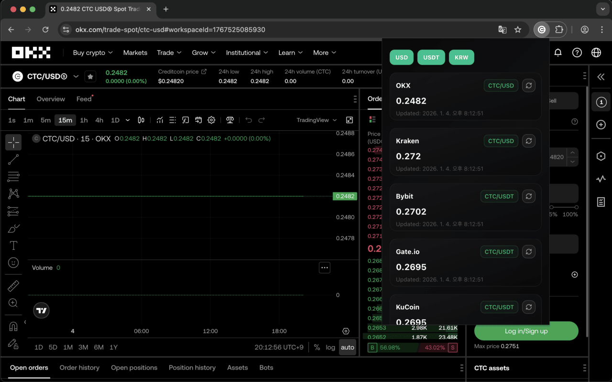

# Creditcoin Price Tracker

Creditcoin Price Tracker is a lightweight Chrome extension that lets you monitor the real-time price of Creditcoin (CTC) across multiple major cryptocurrency exchanges — all in one place.

The extension automatically refreshes price data every 5 seconds, making it ideal for traders, investors, and anyone who wants up-to-date market visibility without constantly refreshing exchange pages.

 

# Privacy & Security
- No account login required
- No personal data collected or stored
- Uses only public exchange APIs
- No trading actions — read-only price monitoring

 

# Who Is This For?
- Crypto traders tracking short-term price movements
- Investors monitoring CTC across different markets
- Users who want quick price checks without opening multiple exchange tabs

 

# Disclaimer
This extension is for informational purposes only and does not provide financial or investment advice. Cryptocurrency prices are highly volatile — always do your own research before making trading decisions.